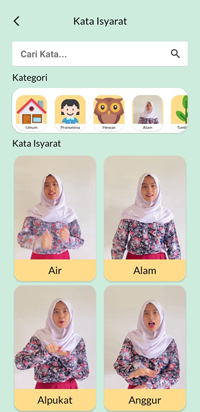

# Judul PA Bahasa Indonesia

Ganti paragraf ini dengan penjelasan singkat mengenai aplikasi. Beri tahu pembaca, repository ini isinya aplikasi apa, siapa target penggunanya, dan apa saja fitur utamanya. Penjelasan dibuat **minimal** 250 karakter. Setelah penjelasan, beri screenshot **maksimal 3** buah. Jika aplikasi belum jadi, screenshot boleh diambil dari Bab 3 (perancangan antarmuka aplikasi).

Tampilan Utama                              | Tampilan Kata                              | Tampilan Praktik
--------------------------------------------|--------------------------------------------|--------------------------------------------
||

### Link Berkas PA

(diisi link Google Drive kelompok PA yang telah disiapkan oleh Tim PA)

### Susunan Tim

Nama            | Username Github | Posisi
----------------|-----------------|-----------
Nama Mahasiswa1 | usernameMhs1    | Mahasiswa
Nama Mahasiswa2 | usernameMhs2    | Mahasiswa
Nama Pembimbing | usernamePbb     | Pembimbing
Nama Reviewer   | usernameRev     | Reviewer